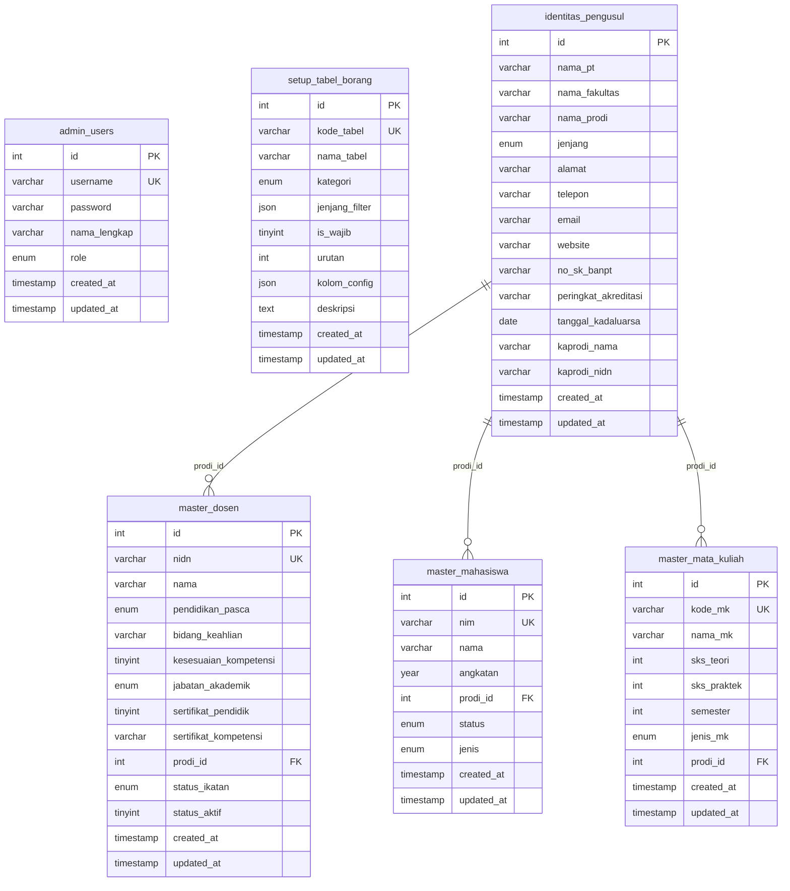
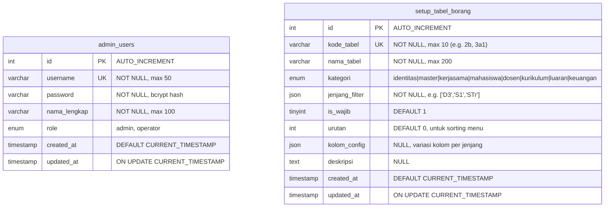
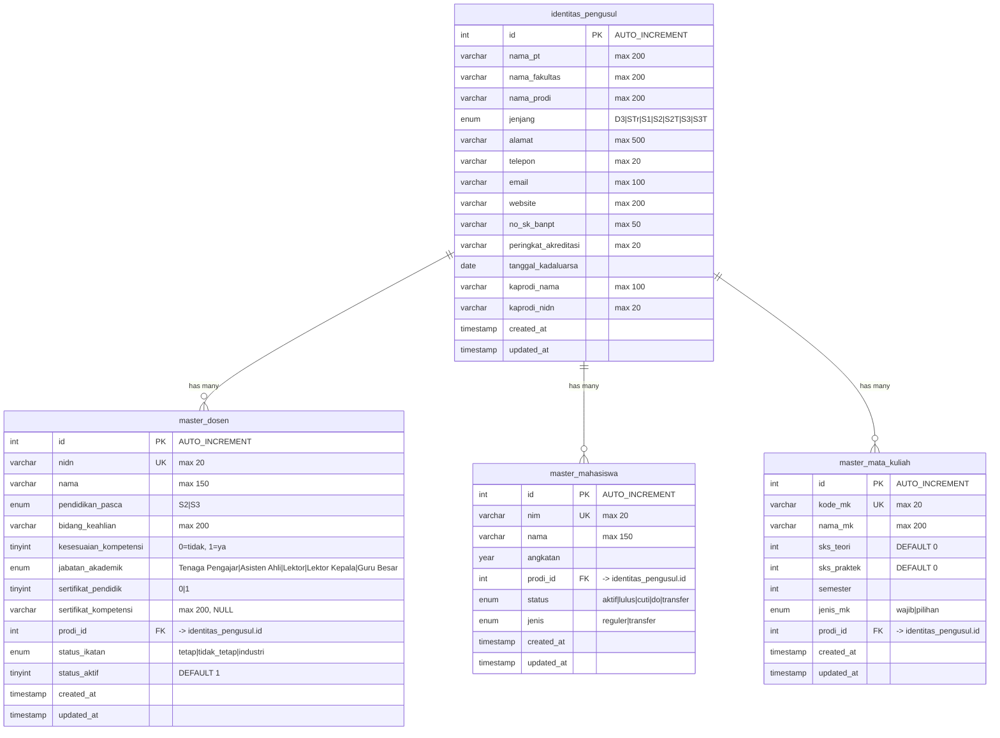
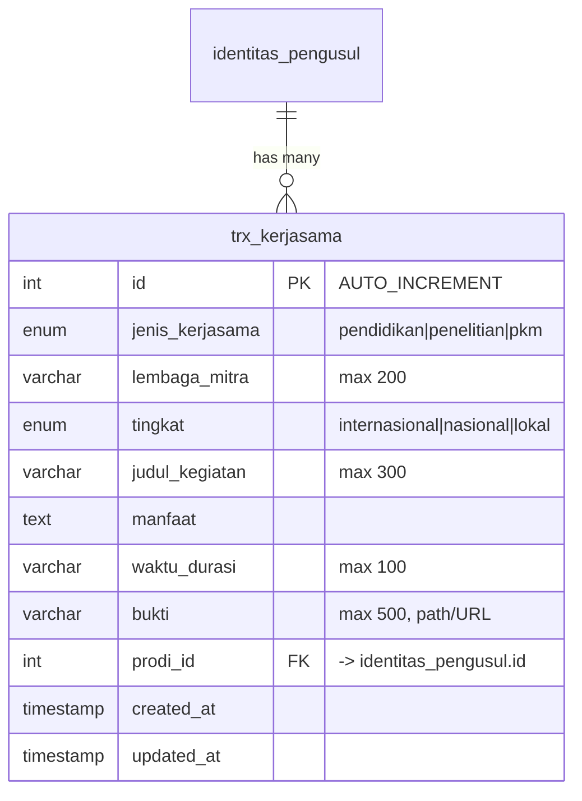
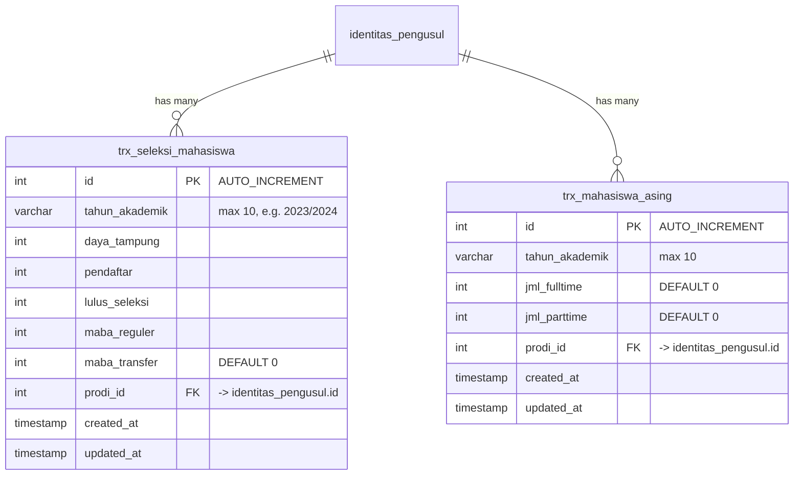
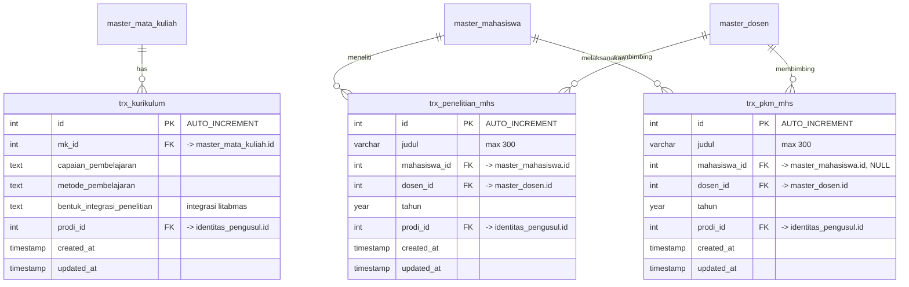
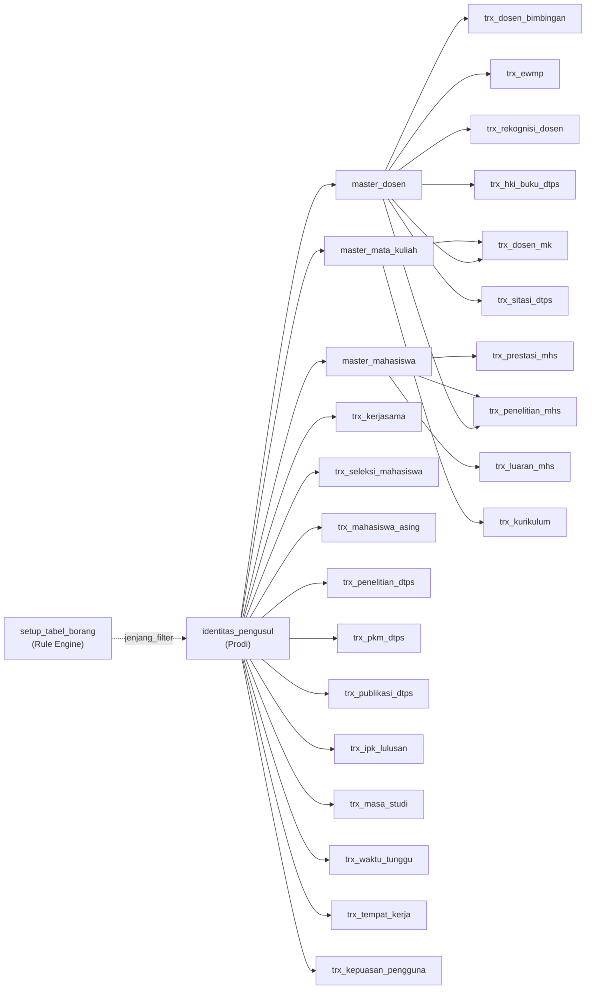

# AKRE — Entity Relationship Diagram (ERD)

> Database Schema untuk **Sistem Manajemen Akreditasi BAN-PT (Tahap 2)**
> Database: `aps` | Engine: InnoDB | Charset: utf8mb4

---

## ERD Overview

---

## Grup A: Admin & Konfigurasi

---

## Grup B: Identitas & Master

---

## Grup C: Kerjasama Tridharma (Tabel 1)

---

## Grup D: Kemahasiswaan (Tabel 2)

---

## Grup E: Dosen & SDM (Tabel 3)

```mermaid
erDiagram
    trx_dosen_mk {
        int id PK "AUTO_INCREMENT"
        int dosen_id FK "-> master_dosen.id"
        int mk_id FK "-> master_mata_kuliah.id"
        varchar tahun_akademik "max 10"
        int semester
        timestamp created_at
    }

    trx_dosen_bimbingan {
        int id PK "AUTO_INCREMENT"
        int dosen_id FK "-> master_dosen.id"
        varchar tahun_akademik "max 10"
        int jml_bimbingan_ps "bimbingan di PS yg diakreditasi"
        int jml_bimbingan_ps_lain "bimbingan di PS lain"
        int prodi_id FK "-> identitas_pengusul.id"
        timestamp created_at
        timestamp updated_at
    }

    trx_ewmp {
        int id PK "AUTO_INCREMENT"
        int dosen_id FK "-> master_dosen.id"
        varchar tahun_akademik "max 10"
        decimal sks_pendidikan_ps "10,2"
        decimal sks_pendidikan_luar "10,2"
        decimal sks_penelitian "10,2"
        decimal sks_pkm "10,2"
        decimal sks_tugas_tambahan "10,2"
        int prodi_id FK "-> identitas_pengusul.id"
        timestamp created_at
        timestamp updated_at
    }

    trx_rekognisi_dosen {
        int id PK "AUTO_INCREMENT"
        int dosen_id FK "-> master_dosen.id"
        varchar bidang_keahlian "max 200"
        text rekognisi "deskripsi pengakuan"
        varchar bukti "max 500"
        int prodi_id FK "-> identitas_pengusul.id"
        timestamp created_at
        timestamp updated_at
    }

    trx_penelitian_dtps {
        int id PK "AUTO_INCREMENT"
        enum sumber "pt_mandiri|dalam_negeri|luar_negeri"
        varchar tahun_akademik "max 10"
        int jumlah_judul
        decimal dana "15,2"
        int prodi_id FK "-> identitas_pengusul.id"
        timestamp created_at
        timestamp updated_at
    }

    trx_pkm_dtps {
        int id PK "AUTO_INCREMENT"
        enum sumber "pt_mandiri|dalam_negeri|luar_negeri"
        varchar tahun_akademik "max 10"
        int jumlah_judul
        decimal dana "15,2"
        int prodi_id FK "-> identitas_pengusul.id"
        timestamp created_at
        timestamp updated_at
    }

    trx_publikasi_dtps {
        int id PK "AUTO_INCREMENT"
        enum jenis "jurnal_tidak_terakreditasi|jurnal_nasional_terakreditasi|jurnal_internasional|jurnal_internasional_bereputasi|seminar_wilayah|seminar_nasional|seminar_internasional|tulisan_media_wilayah|tulisan_media_nasional|tulisan_media_internasional|pagelaran_wilayah|pagelaran_nasional|pagelaran_internasional"
        varchar tahun_akademik "max 10"
        int jumlah_judul
        int prodi_id FK "-> identitas_pengusul.id"
        timestamp created_at
        timestamp updated_at
    }

    trx_hki_buku_dtps {
        int id PK "AUTO_INCREMENT"
        int dosen_id FK "-> master_dosen.id"
        varchar judul "max 300"
        enum jenis "buku_isbn|book_chapter|hki_paten|hki_paten_sederhana|hki_hak_cipta|hki_desain_produk|hki_varietas_tanaman|teknologi_tepat_guna|produk_terstandarisasi|produk_tersertifikasi"
        year tahun
        varchar keterangan "max 300"
        int prodi_id FK "-> identitas_pengusul.id"
        timestamp created_at
        timestamp updated_at
    }

    trx_sitasi_dtps {
        int id PK "AUTO_INCREMENT"
        int dosen_id FK "-> master_dosen.id"
        varchar judul_artikel "max 300"
        varchar jurnal_vol_tahun_hal "max 300"
        int jumlah_sitasi
        int prodi_id FK "-> identitas_pengusul.id"
        timestamp created_at
        timestamp updated_at
    }

    master_dosen ||--o{ trx_dosen_mk : "mengajar"
    master_mata_kuliah ||--o{ trx_dosen_mk : "diampu oleh"
    master_dosen ||--o{ trx_dosen_bimbingan : "membimbing"
    master_dosen ||--o{ trx_ewmp : "EWMP"
    master_dosen ||--o{ trx_rekognisi_dosen : "diakui"
    master_dosen ||--o{ trx_hki_buku_dtps : "menulis"
    master_dosen ||--o{ trx_sitasi_dtps : "disitasi"
    identitas_pengusul ||--o{ trx_penelitian_dtps : "has many"
    identitas_pengusul ||--o{ trx_pkm_dtps : "has many"
    identitas_pengusul ||--o{ trx_publikasi_dtps : "has many"
```

---

## Grup F: Kurikulum & PkM (Tabel 4-7)

---

## Grup G: Luaran & Capaian (Tabel 8)

```mermaid
erDiagram
    trx_ipk_lulusan {
        int id PK "AUTO_INCREMENT"
        year tahun_lulus
        int jml_lulusan
        decimal ipk_min "4,2"
        decimal ipk_max "4,2"
        decimal ipk_rata "4,2"
        int prodi_id FK "-> identitas_pengusul.id"
        timestamp created_at
        timestamp updated_at
    }

    trx_prestasi_mhs {
        int id PK "AUTO_INCREMENT"
        varchar nama_kegiatan "max 300"
        int mahasiswa_id FK "-> master_mahasiswa.id"
        enum tingkat "internasional|nasional|wilayah"
        varchar prestasi "max 200, e.g. Juara 1"
        year tahun
        enum jenis_prestasi "akademik|non_akademik"
        int prodi_id FK "-> identitas_pengusul.id"
        timestamp created_at
        timestamp updated_at
    }

    trx_masa_studi {
        int id PK "AUTO_INCREMENT"
        year tahun_masuk
        int jml_mhs_diterima
        int jml_lulus_akhir_ts
        int jml_lulus_akhir_ts_plus1
        int jml_lulus_akhir_ts_plus2
        int jml_lulus_akhir_ts_plus3
        int jml_lulus_akhir_ts_plus4
        int jml_lulus_akhir_ts_plus5
        int jml_lulus_akhir_ts_plus6
        decimal rata_rata_masa_studi "5,2 semester"
        int prodi_id FK "-> identitas_pengusul.id"
        timestamp created_at
        timestamp updated_at
    }

    trx_waktu_tunggu {
        int id PK "AUTO_INCREMENT"
        year tahun_lulus
        int jml_lulusan
        int jml_terlacak
        int wt_kurang_3bln
        int wt_3_sd_6bln
        int wt_lebih_6bln
        int prodi_id FK "-> identitas_pengusul.id"
        timestamp created_at
        timestamp updated_at
    }

    trx_tempat_kerja {
        int id PK "AUTO_INCREMENT"
        year tahun_lulus
        int jml_lokal "lokal/wirausaha tidak berbadan hukum"
        int jml_nasional "nasional/wirausaha berbadan hukum"
        int jml_multinasional "multinasional/internasional"
        int prodi_id FK "-> identitas_pengusul.id"
        timestamp created_at
        timestamp updated_at
    }

    trx_kepuasan_pengguna {
        int id PK "AUTO_INCREMENT"
        enum jenis_kemampuan "etika|keahlian|bahasa_asing|komunikasi|teknologi_informasi|kerjasama|pengembangan_diri"
        decimal persen_sangat_baik "5,2"
        decimal persen_baik "5,2"
        decimal persen_cukup "5,2"
        decimal persen_kurang "5,2"
        text rencana_tindak_lanjut
        int prodi_id FK "-> identitas_pengusul.id"
        timestamp created_at
        timestamp updated_at
    }

    trx_luaran_mhs {
        int id PK "AUTO_INCREMENT"
        int mahasiswa_id FK "-> master_mahasiswa.id"
        enum jenis "publikasi_jurnal|publikasi_seminar|buku_isbn|book_chapter|hki_paten|hki_paten_sederhana|hki_hak_cipta|hki_desain_produk|hki_varietas_tanaman|teknologi_tepat_guna|produk_terstandarisasi|produk_tersertifikasi|pagelaran_wilayah|pagelaran_nasional|pagelaran_internasional"
        varchar judul "max 300"
        year tahun
        varchar keterangan "max 300"
        int prodi_id FK "-> identitas_pengusul.id"
        timestamp created_at
        timestamp updated_at
    }

    master_mahasiswa ||--o{ trx_prestasi_mhs : "berprestasi"
    master_mahasiswa ||--o{ trx_luaran_mhs : "menghasilkan"
    identitas_pengusul ||--o{ trx_ipk_lulusan : "has many"
    identitas_pengusul ||--o{ trx_masa_studi : "has many"
    identitas_pengusul ||--o{ trx_waktu_tunggu : "has many"
    identitas_pengusul ||--o{ trx_tempat_kerja : "has many"
    identitas_pengusul ||--o{ trx_kepuasan_pengguna : "has many"
```

---

## Ringkasan Relasi Antar Tabel

---

## Statistik Database

| Kategori | Jumlah Tabel | Tabel |
|---|---|---|
| Admin & Config | 2 | `admin_users`, `setup_tabel_borang` |
| Identitas & Master | 4 | `identitas_pengusul`, `master_dosen`, `master_mahasiswa`, `master_mata_kuliah` |
| Kerjasama | 1 | `trx_kerjasama` |
| Kemahasiswaan | 2 | `trx_seleksi_mahasiswa`, `trx_mahasiswa_asing` |
| Dosen & SDM | 8 | `trx_dosen_mk`, `trx_dosen_bimbingan`, `trx_ewmp`, `trx_rekognisi_dosen`, `trx_penelitian_dtps`, `trx_pkm_dtps`, `trx_publikasi_dtps`, `trx_hki_buku_dtps`, `trx_sitasi_dtps` |
| Kurikulum & PkM | 3 | `trx_kurikulum`, `trx_penelitian_mhs`, `trx_pkm_mhs` |
| Luaran & Capaian | 7 | `trx_ipk_lulusan`, `trx_prestasi_mhs`, `trx_masa_studi`, `trx_waktu_tunggu`, `trx_tempat_kerja`, `trx_kepuasan_pengguna`, `trx_luaran_mhs` |
| **Total** | **28** | |
