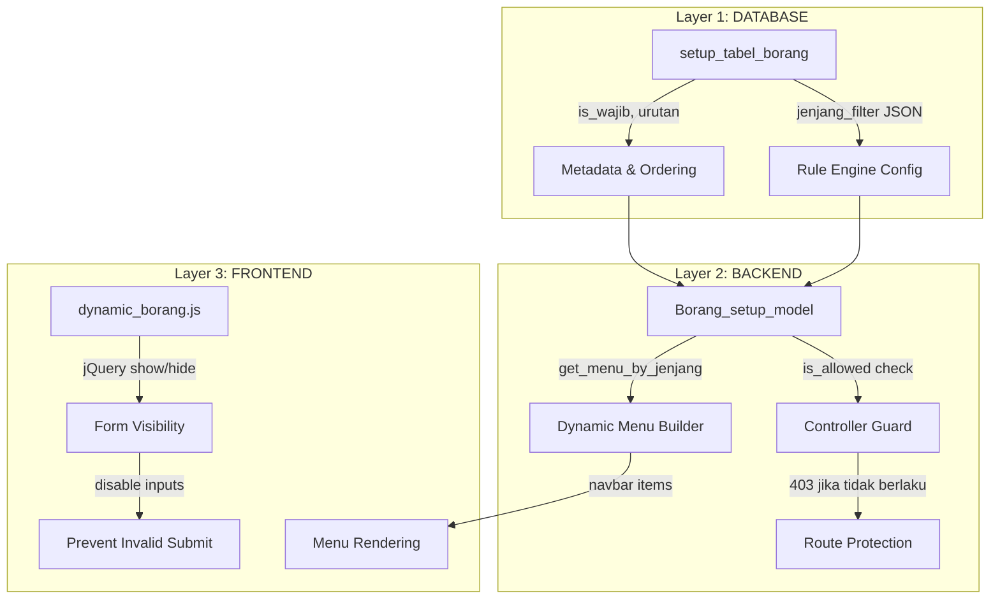

# AKRE — Implementation Plan (v5 — 3-Layer Architecture)

> **Sistem Manajemen Akreditasi BAN-PT (Tahap 2)** — CodeIgniter 3 dengan arsitektur validasi 3 lapis untuk pengecekan jenjang dan skalabilitas.

---

## Arsitektur Validasi 3 Lapis



### Layer 1: Database (Config & Metadata)

**Tabel `setup_tabel_borang`** — Single source of truth:

```sql
CREATE TABLE setup_tabel_borang (
    id INT AUTO_INCREMENT PRIMARY KEY,
    kode_tabel VARCHAR(10) NOT NULL UNIQUE,
    nama_tabel VARCHAR(200) NOT NULL,
    kategori ENUM('identitas','master','kerjasama','mahasiswa',
                  'dosen','kurikulum','luaran','keuangan') NOT NULL,
    jenjang_filter JSON NOT NULL,
    is_wajib TINYINT(1) DEFAULT 1,
    urutan INT DEFAULT 0,
    kolom_config JSON DEFAULT NULL COMMENT 'Kolom khusus per jenjang jika ada',
    deskripsi TEXT,
    created_at TIMESTAMP DEFAULT CURRENT_TIMESTAMP,
    updated_at TIMESTAMP DEFAULT CURRENT_TIMESTAMP ON UPDATE CURRENT_TIMESTAMP
);
```

- `jenjang_filter`: `["D3","S1","STr","S2","S2T","S3","S3T"]`
- `kolom_config`: untuk variasi kolom per jenjang (misal: 3b4 punya kategori publikasi berbeda untuk akademik vs terapan)
- Semua perubahan aturan cukup update di tabel ini — **zero code change**

### Layer 2: Backend (Validation Logic)

**`Borang_setup_model`** — Gate keeper:
```php
// Cek apakah tabel berlaku untuk jenjang
public function is_allowed($kode_tabel, $jenjang) { ... }

// Ambil semua tabel yang berlaku untuk jenjang (untuk menu)
public function get_menu_by_jenjang($jenjang) { ... }

// Ambil config kolom untuk jenjang tertentu
public function get_kolom_config($kode_tabel, $jenjang) { ... }
```

**Controller Guard** — di setiap controller:
```php
public function seleksi_mhs_asing() {
    if (!$this->borang_setup_model->is_allowed('2b', $this->current_jenjang)) {
        show_error('Tabel ini tidak berlaku untuk jenjang ' . $this->current_jenjang, 403);
    }
    // ... proceed
}
```

### Layer 3: Frontend (UI/UX Logic)

**`dynamic_borang.js`** — Client-side behavior:
- Navbar menu items di-render berdasarkan data dari Layer 2
- Form fields show/hide berdasarkan jenjang via jQuery
- Disabled inputs tidak dikirim saat submit
- Jenjang selector di identitas prodi → trigger AJAX refresh menu

**Keuntungan 3-Layer:**
- **Skalabilitas**: Tambah jenjang baru (misal Profesi) → cukup INSERT ke `setup_tabel_borang`
- **Maintainability**: Aturan terpusat di database, bukan tersebar di code
- **Defense in depth**: Meskipun frontend dibypass, backend tetap memvalidasi

---

## Matriks Jenjang (dari gambar referensi)

> Total per jenjang: **D3=33, S=38, STr=41, M=36, MTr=38, D=33, DTr=35**

| # | Kode | Nama Tabel | D3 | S | STr | M | MTr | D | DTr |
|---|---|---|---|---|---|---|---|---|---|
| 1 | 1-1 | Kerjasama Pendidikan | ✓ | ✓ | ✓ | ✓ | ✓ | ✓ | ✓ |
| 2 | 1-2 | Kerjasama Penelitian | ✓ | ✓ | ✓ | ✓ | ✓ | ✓ | ✓ |
| 3 | 1-3 | Kerjasama PkM | ✓ | ✓ | ✓ | ✓ | ✓ | ✓ | ✓ |
| 4 | 2a | Seleksi Mahasiswa Baru | ✗ | ✓ | ✗ | ✓ | ✗ | ✓ | ✗ |
| 5 | 2b | Mahasiswa Asing | ✓ | ✓ | ✓ | ✓ | ✓ | ✓ | ✗ |
| 6 | 3a1 | Dosen Tetap PT | ✓ | ✓ | ✓ | ✓ | ✓ | ✓ | ✓ |
| 7 | 3a2 | Pembimbing Utama TA | ✓ | ✓ | ✗ | ✓ | ✗ | ✓ | ✗ |
| 8 | 3a3 | EWMP Dosen Tetap | ✗ | ✓ | ✗ | ✗ | ✗ | ✗ | ✗ |
| 9 | 3a4 | Dosen Tidak Tetap | ✗ | ✓ | ✗ | ✓ | ✗ | ✗ | ✗ |
| 10 | 3a5 | Dosen Industri/Praktisi | ✓ | ✗ | ✓ | ✗ | ✓ | ✗ | ✗ |
| 11 | 3b1 | Rekognisi Dosen | ✗ | ✓ | ✗ | ✓ | ✗ | ✓ | ✗ |
| 12 | 3b2 | Penelitian DTPS | ✗ | ✓ | ✗ | ✗ | ✓ | ✗ | ✗ |
| 13 | 3b3 | PkM DTPS | ✓ | ✓ | ✓ | ✓ | ✓ | ✓ | ✓ |
| 14 | 3b4 | Publikasi Ilmiah DTPS | ✓ | ✓ | ✓ | ✓ | ✓ | ✓ | ✓ |
| 15 | 3b5 | HKI & Buku DTPS | ✓ | ✓ | ✓ | ✓ | ✓ | ✓ | ✓ |
| 16 | 3b6 | Sitasi DTPS | ✓ | ✓ | ✓ | ✓ | ✓ | ✓ | ✓ |
| 17 | 3b7 | Luaran Lain DTPS | ✓ | ✓ | ✓ | ✓ | ✓ | ✓ | ✓ |
| 18 | 4 | Keuangan & Sarpras | ✓ | ✓ | ✓ | ✓ | ✓ | ✓ | ✓ |
| 19 | 5a | Kurikulum | ✓ | ✓ | ✓ | ✓ | ✓ | ✓ | ✓ |
| 20 | 5b | Integrasi Litabmas | ✓ | ✓ | ✓ | ✓ | ✓ | ✓ | ✓ |
| 21 | 5c | Kepuasan Mhs Pembelajaran | ✓ | ✓ | ✓ | ✓ | ✓ | ✓ | ✓ |
| 22 | 6a | Penelitian DTPS + Mhs | ✓ | ✓ | ✓ | ✓ | ✓ | ✓ | ✓ |
| 23 | 6b | Penelitian Rujukan Tesis | — | ✓ | — | ✓ | ✓ | ✓ | ✓ |
| 24 | 7 | PkM DTPS + Mhs | ✓ | ✓ | ✓ | ✓ | ✓ | ✓ | ✓ |
| 25 | 8a | IPK Lulusan | ✓ | — | ✓ | — | — | — | — |
| 26 | 8b1 | Prestasi Akademik Mhs | ✓ | ✓ | ✓ | ✓ | ✓ | ✓ | ✓ |
| 27 | 8b2 | Prestasi Non-akademik | ✓ | ✓ | ✓ | — | — | — | — |
| 28 | 8c | Masa Studi Lulusan | ✓ | ✓ | ✓ | ✓ | ✓ | ✓ | ✓ |
| 29 | 8d1 | Waktu Tunggu Lulusan | ✓ | ✓ | ✓ | ✓ | ✓ | — | — |
| 30 | 8d2 | Kesesuaian Bidang Kerja | ✓ | ✓ | ✓ | ✓ | ✓ | ✓ | ✓ |
| 31 | 8e1 | Tempat Kerja Lulusan | ✓ | ✓ | ✓ | ✓ | ✓ | ✓ | ✓ |
| 32 | 8e2 | Kepuasan Pengguna | ✓ | ✓ | ✓ | ✓ | ✓ | — | — |
| 33 | 8f1 | Publikasi Ilmiah Mhs | — | ✓ | — | ✓ | — | ✓ | — |
| 34 | 8f1-t | Publikasi Mhs (Terapan) | ✓ | — | ✓ | — | ✓ | — | ✓ |
| 35 | 8f2 | Sitasi Karya Mhs | ✓ | ✓ | ✓ | ✓ | ✓ | ✓ | ✓ |
| 36 | 8f3 | Luaran Mhs - Buku | ✓ | ✓ | ✓ | ✓ | ✓ | ✓ | ✓ |
| 37 | 8f4-1 | Luaran Mhs - HKI Paten | ✓ | ✓ | ✓ | ✓ | ✓ | ✓ | ✓ |
| 38 | 8f4-2 | Luaran Mhs - HKI Hak Cipta | ✓ | ✓ | ✓ | ✓ | ✓ | ✓ | ✓ |
| 39 | 8f4-3 | Luaran Mhs - Teknologi | ✓ | ✓ | ✓ | ✓ | ✓ | ✓ | ✓ |
| 40 | 8f4-4 | Luaran Mhs - Produk | ✓ | ✓ | ✓ | ✓ | ✓ | ✓ | ✓ |

> [!IMPORTANT]
> Matriks ini perlu di-cross-check final oleh user terhadap gambar referensi karena beberapa sel ambigu. Seeder akan dibuat sesuai tabel ini dan dapat diupdate via menu Pengaturan.

---

## Proposed Changes (6 Fase)

### Fase 1: Project Configuration
- [MODIFY] `config.php` — base_url, index_page, encryption_key, sess_save_path
- [MODIFY] `database.php` — localhost/root/''/aps
- [MODIFY] `autoload.php` — database, session, url, form
- [MODIFY] `routes.php` — default_controller auth/login
- [NEW] `.htaccess` — clean URLs

### Fase 2: Asset Download (Zero-CDN)
- Bootstrap 5.3.8 (CSS + JS bundle)
- jQuery 3.7.1
- Bootstrap Icons 1.11.3 (CSS + woff2 + woff)
- Custom CSS (mobile-first) + JS (dynamic_borang.js)

### Fase 3: Authentication System
- [NEW] `MY_Controller.php` — auth guard + jenjang context
- [NEW] `Auth.php` controller — login/logout
- [NEW] `Auth_model.php` — authenticate, get_user_by_id
- [NEW] `views/auth/login.php` — mobile-first card

### Fase 4: Database Schema + Rule Engine Seeder
- [NEW] `database/aps_schema.sql` — all tables + FK constraints + seeder
- `setup_tabel_borang`: 40 rows seeder per matriks di atas
- `admin_users`: admin/admin (bcrypt)
- All master + transaction tables

### Fase 5: Layout (Navbar, Mobile-First)
- [NEW] `views/layout/header.php` — top navbar, **dynamic menu from Layer 2**
- [NEW] `views/layout/footer.php` — JS + page scripts
- [NEW] `assets/css/custom_admin.css` — mobile-first
- [NEW] `assets/js/dynamic_borang.js` — **Layer 3 jenjang logic**

### Fase 6: Controllers, Models & Views
- 8 controllers, 8 models, ~30 views (list + form pairs)
- Every controller calls `is_allowed()` before rendering
- Menu items filtered by `get_menu_by_jenjang()`

---

## Verification Plan

1. Login → dashboard works
2. Set jenjang D3 → Tabel 2b hidden from navbar & returns 403 if accessed directly
3. Set jenjang S1 → Tabel 3a5 hidden, Tabel 2b visible
4. All assets load (no 404)
5. Mobile navbar hamburger works at 375px
6. CRUD test on Master Dosen
